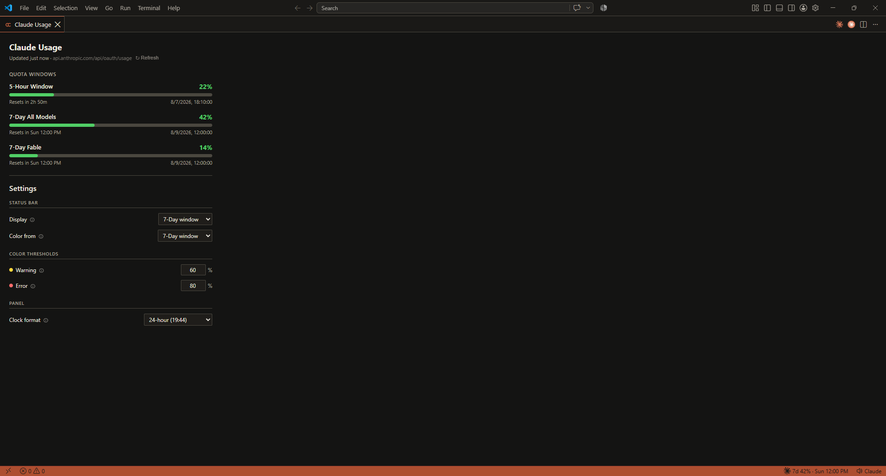
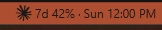
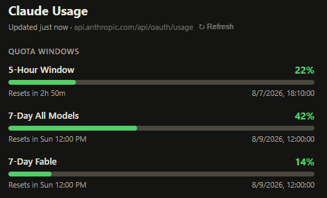

# Claude Code Usage Monitor

A VS Code extension that shows your real-time Claude Code quota usage directly in the status bar — powered by the official Anthropic OAuth usage API.



## How It Works

The extension authenticates using the OAuth token that Claude Code already stores locally at `~/.claude/.credentials.json`. It polls `GET https://api.anthropic.com/api/oauth/usage` every 2 minutes (only when the window is focused) and displays the results without any additional login or configuration.

## Features

- **Status bar** — shows your 5-hour window utilization % and time until reset, color-coded green/yellow/red
- **Usage panel** — click the status bar to open a full panel with progress bars for every active quota window
- **Extra usage** — displays pay-as-you-go credit spend if enabled on your account
- **Zero config** — reads your existing Claude Code credentials automatically

## Status Bar



```
☁ 69% · 2h 14m
```

- **69%** — percentage of your 5-hour quota used
- **2h 14m** — time until the 5-hour window resets
- Hover for a tooltip with all active quota windows

Colors:
- Green — < 60%
- Yellow — 60–80%
- Red — > 80%

### Customising the text

The status bar is driven by a format template, `claude-usage-monitor.statusBarFormat`. Windows are addressed as `{5h.…}`, `{7d.…}`, `{extra.…}` (pay-as-you-go), `{max.…}` (whichever window is highest right now) or `{model:<display name>.…}` — the last one resolves against whatever models your account reports, so a new tier is addressable without a new release.

| Template | Renders |
| --- | --- |
| `{icon} {5h.pct} · {5h.reset}` | `12% · 3h 40m` *(default)* |
| `{icon} 5h {5h.pct} · 7d {7d.pct}` | `5h 12% · 7d 2%` |
| `{icon} Fable {model:Fable.pct}` | `Fable 91%` |
| `{icon} {max.name} {max.pct}` | `Fable 91%` — follows whichever window is worst |
| `{icon} {5h.bar} {5h.pct}` | `█░░░░░░░░░ 12%` |
| `{icon} {extra.spent} / {extra.limit}` | `$12.50 / $40.00` |

Fields are `.pct`, `.reset`, `.resetAt`, `.name` and `.bar`, plus `.spent` and `.limit` on the pay-as-you-go window. `{icon}` inserts the Claude mark and `{{`/`}}` escape literal braces.

A token naming a window your account doesn't report renders empty, and the separator it stranded is removed rather than left dangling — so `{extra.spent} / {extra.limit}` shows just `$7.00` when no monthly cap is set, and pay-as-you-go tokens disappear entirely when credits are off.

The usage panel's **Settings** tab has presets, a live preview, and a checkbox per window for `claude-usage-monitor.statusBarColorFrom`, which colours the bar from the highest of the windows you check (default: the 5-hour and 7-day windows).

### When a window runs out

At 100% the format is set aside — the only thing that matters then is when you can resume — and the status bar reads `blocked · 47m`, or `Fable blocked · Sun 4:29 AM` for a per-model window. If several are exhausted it shows the one resetting soonest. The panel marks those bars **Exhausted — resets in …**.

### Notifications

A red status bar is easy to miss mid-file, so `claude-usage-monitor.notifications` announces threshold crossings:

- `error` *(default)* — at the error threshold, and again when a window is exhausted
- `all` — also at the warning threshold
- `off` — never

Each window notifies **at most once per reset cycle**, escalating only if it gets worse (warning → error → exhausted), so it never repeats on every poll.

## Usage Panel



Click the status bar item (or run **Claude: Show Usage** from the Command Palette) to open a panel showing:

- **5-Hour Window** — your primary rolling quota with a progress bar and reset time
- **7-Day All Models** — weekly quota utilization
- **Per-model weekly windows** — one bar per model limit the API reports (e.g. **7-Day Fable**), parsed generically so new model tiers show up automatically
- **Extra Usage** — pay-as-you-go credits spent this month (when enabled)

## Commands

| Command | Description |
|---------|-------------|
| `Claude: Show Usage` | Open the usage panel |
| `Claude: Refresh Usage` | Force an immediate API poll |

## Requirements

- VS Code 1.104.0 or higher
- Claude Code installed and logged in (so `~/.claude/.credentials.json` exists)
- Internet connection (to reach `api.anthropic.com`)

## Data Source

All data comes from the Anthropic API — the same source Claude Code itself uses for its internal quota display. No local JSONL parsing or file watching is involved.

The credentials file path follows Claude Code's own resolution logic:
1. `$CLAUDE_CONFIG_DIR/.credentials.json` if the env var is set
2. `~/.claude/.credentials.json` otherwise

## Privacy

- No data is collected or sent anywhere other than `api.anthropic.com`
- The OAuth token is read from disk and used only for the usage API call
- No telemetry

## License

MIT
